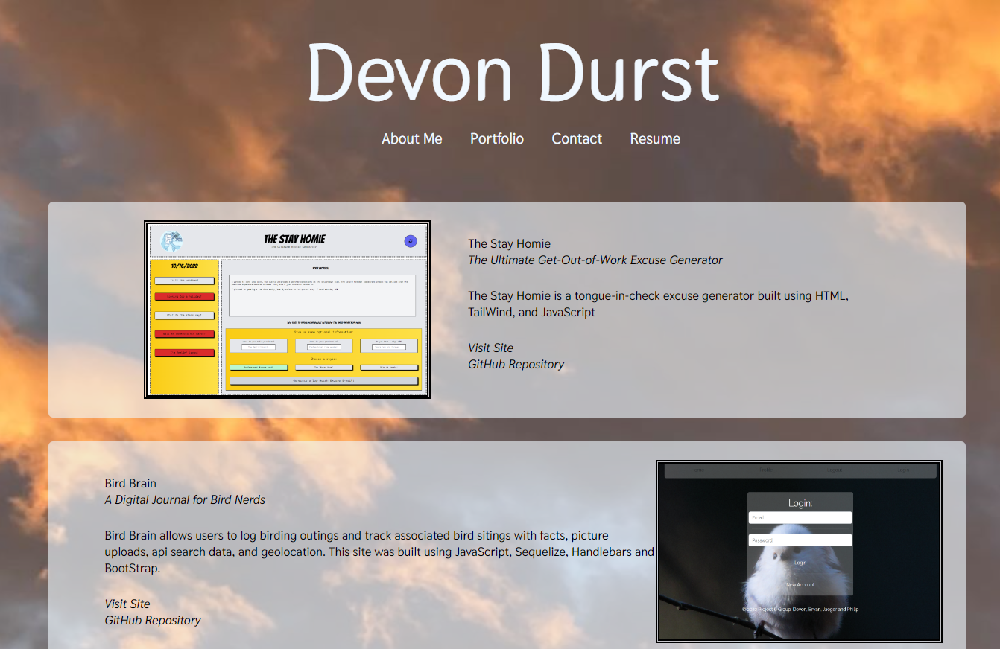

# Devon Durst React Portfolio
A personlized portfolio project built using React.js

## Description

This is a front-end built application using a front-end React repository featuring a portfolio of projects, a downloadable resume, and contact information. 

## Usage
Upon reaching the landing page, use the links listed below the title to access different content pages. 

## Links
Deployed Site: https://devon-durst.netlify.app/
GitHub Repository: https://github.com/D-Dursty/devon-durst

## Screenshots

## License
MIT

## Credits

This webpage was built using React.js and CSS by Devon Durst, December 2022